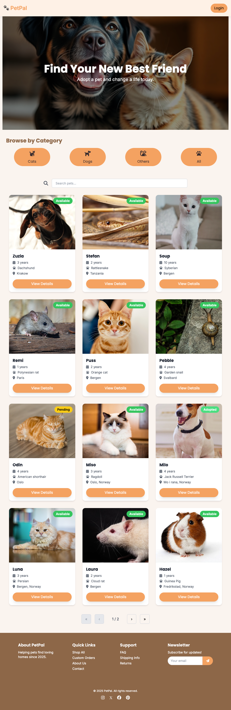
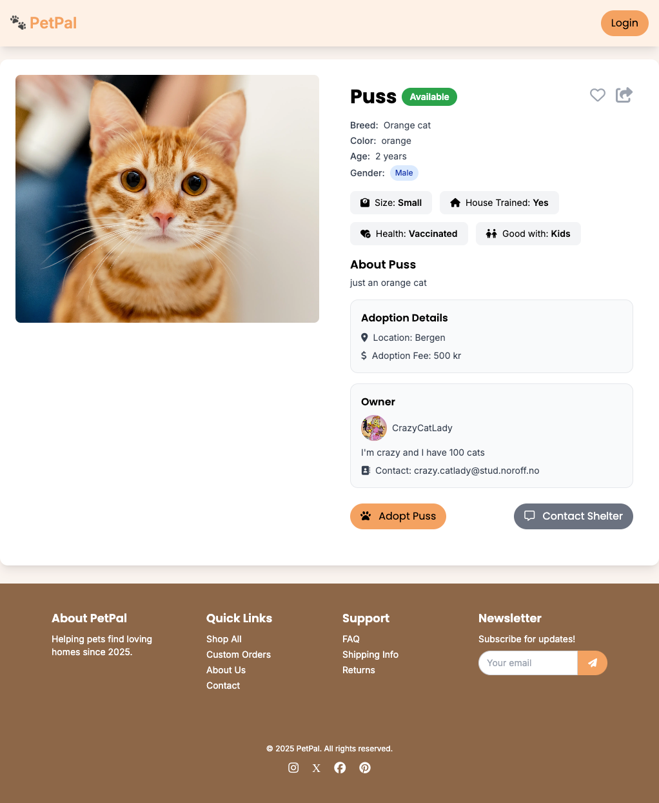
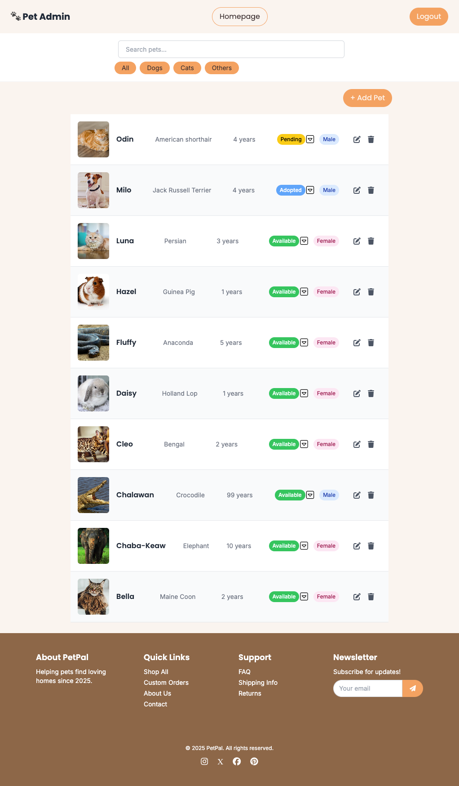

# 🐾 PetPal – Pet Adoption Platform

Welcome to **PetPal**, a modern and responsive pet adoption web application built as part of **Semester Project 2** for the Noroff Front-End Development course (FED2). This application allows users to explore pets available for adoption and provides administrators with tools to manage listings securely.

**🔗 Live site:** [pet-adoption-dev.netlify.app](https://pet-adoption-dev.netlify.app)

---

## 📚 Project Overview

PetPal is a full-featured front-end application powered by Vanilla JavaScript and Tailwind CSS. It communicates with the Noroff v2 API to deliver a rich experience for users and admins alike.

The application supports:

- Public users browsing pets, viewing details, and sharing.
- Admins securely registering, logging in, adding, editing, and deleting pet listings.

This project fulfills all user stories outlined in the official brief.

---

## 🚀 Features

## 📸 Screenshots

<div style="display: flex; justify-content: flex-start; gap: 20px;">
  <div>
    
    <p><strong>Homepage</strong></p>
  </div>
  <div>
    
    <p><strong>Pet Detail</strong></p>
  </div>
  <div>
    
    <p><strong>Admin Dashboard</strong></p>
  </div>
</div>


### 🦡 User-facing
- View a list/grid of all adoptable pets.
- Search and filter by species.
- View detailed pet profiles.
- Copy shareable links.

### 🔐 Admin-facing
- Register and log in.
- Create new pet listings with image preview.
- Edit and delete pet details.
- Logout confirmation and access control.
- Feedback via modals instead of alerts.

---

## 🛠️ Tech Stack

| Category        | Tools & Technologies              |
|----------------|-----------------------------------|
| Language        | Vanilla JavaScript (ES Modules)   |
| CSS Framework   | Tailwind CSS 3                    |
| Build Tool      | Vite                              |
| API             | Noroff v2 API                     |
| Hosting         | Netlify                           |
| Planning        | GitHub Projects (Kanban + Roadmap)|
| Design          | Figma (Style Guide + Prototypes)  |

---

## 📁 Project Structure

```plaintext
├── account/
│   ├── login/index.html
│   └── register/index.html
├── admin/index.html
├── pet/
│   ├── index.html
│   ├── create/index.html
│   └── edit/index.html
├── public/assets/
├── src/
│   ├── css/style.css
│   ├── js/
│   │   ├── api/ (auth, pet, headers)
│   │   ├── router/views/ (home, login, pet, etc.)
│   │   ├── ui/ (auth, pet, global)
│   │   ├── utilities/
│   │   └── main.js
├── index.html
├── README.md
├── vite.config.js
└── tailwind.config.js
```

---

## 📦 Installation

To set up this project locally:

1. **Clone the repository:**

```bash
git clone https://github.com/Panida287/Semester-project-2.git
cd Semester-project-2
```

2. **Install dependencies:**

```bash
npm install
```

3. **Start local dev server:**

```bash
npm run dev
```

4. Visit `http://localhost:5173` in your browser to view the app.

---

## 🔐 Environment Variables & API Key

This project requires an API key to interact with the Noroff API.

### 📍 Get Your API Key

Visit the Noroff API documentation to generate your personal API key:  
👉 [https://docs.noroff.dev/docs/v2/auth/api-key](https://docs.noroff.dev/docs/v2/auth/api-key)

### ⚙️ How to Use the API Key Locally

1. Create a `.env` file in the root of your project:

```bash
touch .env
```

2. Add your API key inside the `.env` file like so:

```env
VITE_API_KEY=your-api-key-here
```

> Replace `your-api-key-here` with your actual key from the Noroff dashboard.

3. In your JavaScript, import it using Vite's environment variable syntax:

```js
const API_KEY = import.meta.env.VITE_API_KEY;
```

4. Add `.env` to your `.gitignore` to keep it private:

```bash
echo ".env" >> .gitignore
```

5. Restart the dev server:

```bash
npm run dev
```

You're now ready to securely use the Noroff API in your development environment.

---

## ✨ Design & Accessibility

- Responsive layout for desktop and mobile.
- WCAG-compliant color palette.
- Interactive Figma prototype and style guide with:
  - Fonts
  - Colors
  - Logo
  - UI Components

---

## 📂 Deployment

Hosted via **Netlify** at [pet-adoption-dev.netlify.app](https://pet-adoption-dev.netlify.app). The project uses Vite for building and bundling.

---

## 📄 License

This project is for educational purposes under Noroff's guidelines and is not intended for production use or distribution.

---
